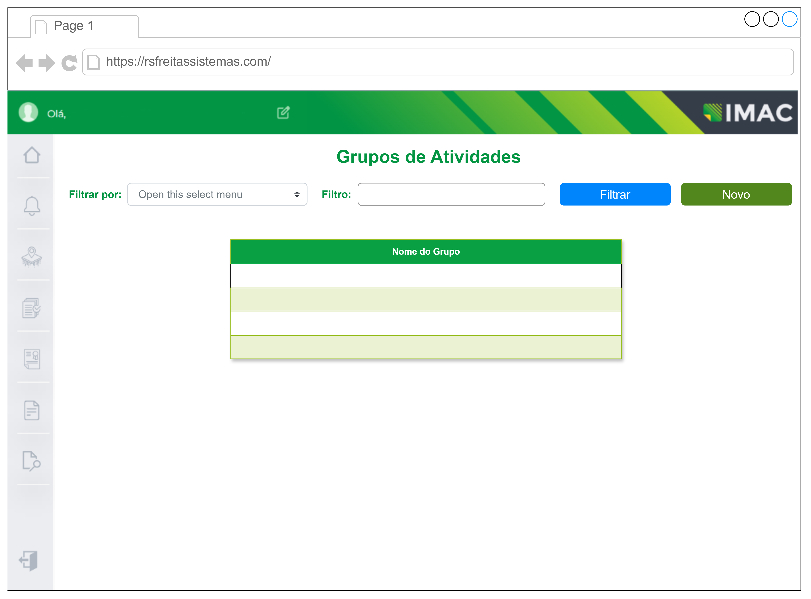
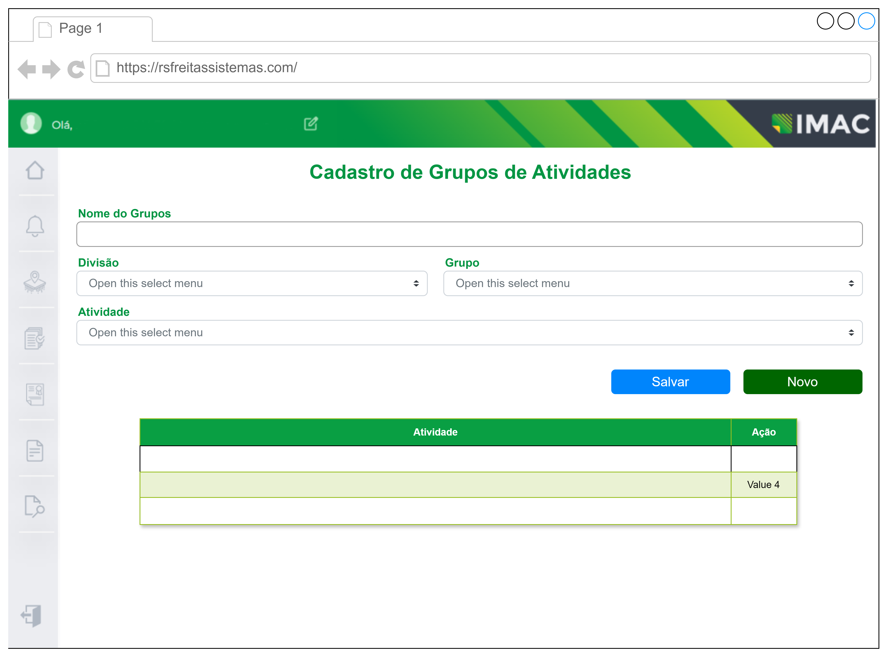
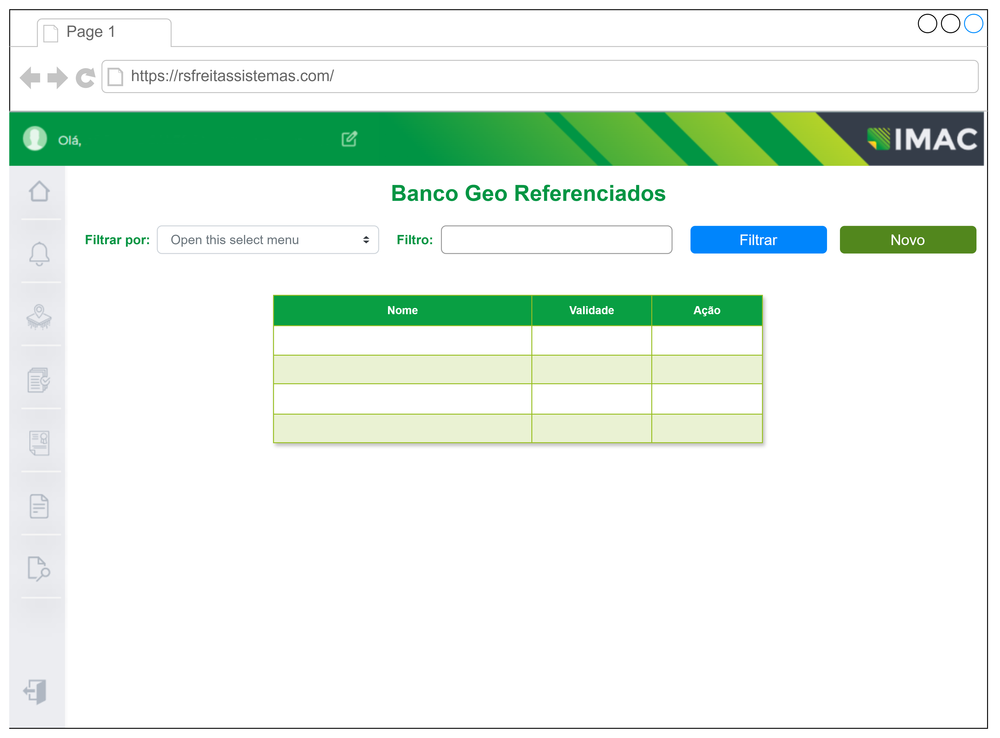
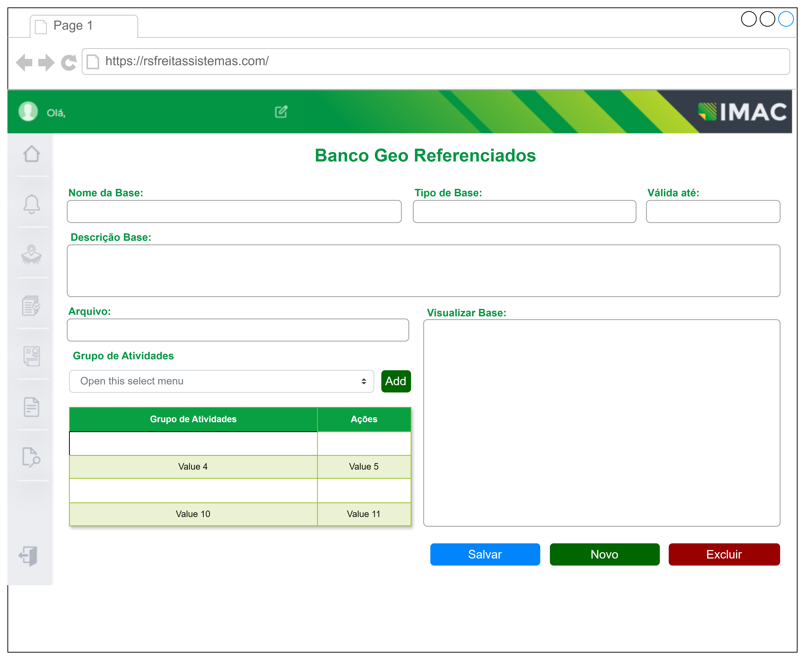
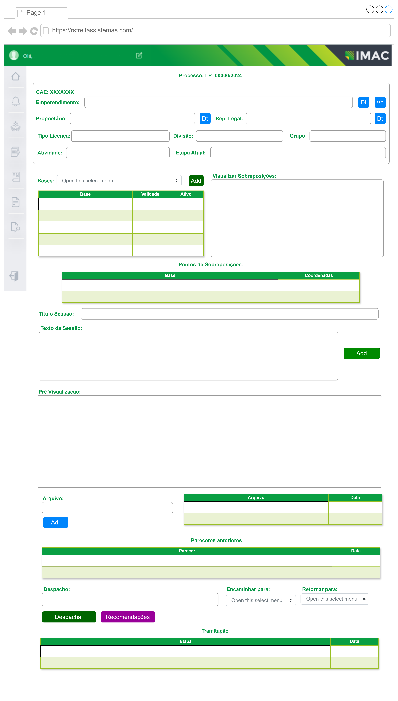

# MÓDULO DE GEOPROCESSAMENTO

## ESPECIFICAÇÃO DE REQUISITOS

### PROBLEMA DE NEGÓCIO

&nbsp;&nbsp;Parte integrante do processo de Licenciamento Ambiental, este processo é requisitado sob demanda e tem diversas atividades relativas não apenas a medição de áreas, como a identificação inteligente de diferentes pontos e elementos dentro de uma propriedade rural ou empreendimento.

&nbsp;&nbsp;Os analistas, bem como equipe técnica relacionada a fiscalização, têm como um dos pontos principais, a correta definição destes elementos, a fim de avaliar se a solicitação de licença está em concordância com a legislação vigente, como também, fiscalizar a atuação de propriedades e empreendimentos, no que tange aos impactos acarretados no meio-ambiente.

&nbsp;&nbsp;Devido a importância da atividade, bem como ao número de solicitações de emissão de licenças e atividades de fiscalização demandadas à equipe técnica, bem como o volume e a diversidade dos dados que devem se analisados em cada processo, existe a necessidade de recursos tecnológicos que amparem a tomada de decisão da equipe técnica, utilizando recursos de Geoprocessamento de forma eficiente e assertiva.

&nbsp;&nbsp;Com o desenvolvimento do módulo de Geoprocessamento, o sistema deverá permitir a equipe técnica competente realizar a análise das propriedades rurais e empreendimentos, possibilitando a visualização de diversos shapes e layers, bem como a identificação de diferentes elementos contidos nos shapes (linhas, polígonos, pontos). Também deverá ser possível realizar a medição de áreas, bem como operações diversas com polígonos, e também cruzamento de informações dos shapes com bases de sensoriamento já existentes.

### HISTÓRIA PRINCIPAL

&nbsp;&nbsp;Durante o processo de lincenciamento o técnico analisando a documentação poderá, a qualquer momento, entender pela necissidade de análise qaunto ao geo posicionamento do empreendimento proposto bem como se tal localização impacta sobre áreas legalmente protegidas. Para tanto este deve encaminhar, via sistema, o processo ao setor adequado, os ténicos devem, a partir dos dados e documentos anexados pelo solicitante, determinar a localização do imóvel e do empreendimento na área indicado, identificar área do empreendimento e confrotenates e indicar se a atividade proposta na localização indicada encontra restrição em algum aspecto legal.

### REQUISITOS FUNCIONAIS

#### R1 - Manter grupos/categorias de atividades

&nbsp;&nbsp;Sistema deve permitir a criação de grupo ou categorias para agrupamento das atividades, a fim de facilitar a o cadastro e a manutenção dos requisitos, de acorde com os tipos de análise esperado.

##### &nbsp;&nbsp;R1.1 - Deve permitir a busca de regsitro por grupo ou por atividade

&nbsp;&nbsp;&nbsp;&nbsp;Na tela de lista de grupos deve permitir filtrar os registros por atividade ou por grupo de atividades

##### &nbsp;&nbsp;R1.2 - Cada atividade só poderá está em um grupo

&nbsp;&nbsp;&nbsp;&nbsp;No cadastro de grupos as atividades já vinculadas a um grupo não devem ser listadas para nova inclusão

##### &nbsp;&nbsp;R1.3 - Deve permitir a inclusão/remoção de atividades nos grupos

&nbsp;&nbsp;&nbsp;&nbsp;Deve permitir a associação e deassociação das atividades aos grupos

#### R2 - Manter Bases GeoReferênciadas

&nbsp;&nbsp;O Sistema  deverá permitir a manutenção de bases de shapes/mapas que serão utilizados na análise das solicitações, tanto de licenciamento, quanto em ações de fiscalização. As bases deverão manter versões distintas, incluindo a data de criação de cada versão, ou seja, ao atualizar uma base, seus dados anteriores serão mantidos pois servirão de histórico / auditoria em análises de licenciamento já realizadas.

##### &nbsp;&nbsp;R2.1 – Permitir inserir diversas bases

&nbsp;&nbsp;&nbsp;&nbsp;O sistema deverá permitir inserir diferentes bases, com shapes e seus metadados, afim de servirem como artefato e apoio a análise realizada pela equipe técnica.  Cada base deve ter um nome que identifica a base utilizada. Deve ser informado no cadastro também até que data a base deve ser consideradad válida.

##### &nbsp;&nbsp;R2.2 – Permitir atualizar bases cadastradas

&nbsp;&nbsp;&nbsp;&nbsp;O sistema deverá permitir a atualização das bases cadastradas, possibilitando a atualização total da base. 

##### &nbsp;&nbsp;R2.3 – Permitir remover bases cadastrada

&nbsp;&nbsp;&nbsp;&nbsp;O Sistema deverá permitir a remoção de uma base cadastrada, desde que ela não tenha sido utilizada em algum processo de solicitação de licenciamento ou de fiscalização.

##### &nbsp;&nbsp;R2.4 – Visualizar uma base existente

&nbsp;&nbsp;&nbsp;&nbsp;O Sistema deverá permitir a visualização de uma base (ou versão de uma base) previamente cadastrada, exibindo todas as suas informações (incluindo a visualização dos shapes e seus componentes).

##### &nbsp;&nbsp;R2.5 – Vincular uma base a um processo de licenciamento

&nbsp;&nbsp;&nbsp;&nbsp;O Sistema deverá permitir que uma ou mais bases existentes sejam vinculadas a um determinado pedido de licenciamento. Estas bases poderão ser utilizadas no processo de análise do pedido por parte da equipe de GEO. A utilização de uma ou mais bases ficará a cargo do técnico/analista, mas servirá como base de análise, otimizando as informações que o analista poderia acessar.

##### &nbsp;&nbsp;R2.6 – Emitir relatório de bases vencidas

&nbsp;&nbsp;&nbsp;&nbsp; O Sistema deverá ter opção para emissão de relatório contendo todas as bases com data de validade ultrapassa.

#### R3 - Manter relação de pre-requistos documentais às análise, a partir dos grupos

&nbsp;&nbsp;Sistema deve permitir cadastro de lista de documentos e arquivos necessários para início da análise, quando do cadastro da solicitação o sistema deverá permitir que o solicitante anexe todos os arquivos solicitados ao processo

##### &nbsp;&nbsp;R3.1 – Cadastrar e/ou alterar relação com conjunto de requisitos necessário ao início da análise

&nbsp;&nbsp;O Sistema deverá permitir associaciar requisitos de documentos ou arquivos a cada um dos grupos cadastrado e listar esses requisito para envio pelo o solicitante

##### &nbsp;&nbsp;R3.2 – Permitir a buscar requisitos por atividade ou por grupo

&nbsp;&nbsp;&nbsp;&nbsp;O sistema deverá permitir filtrar as lista de requisitos por atividade ou por grupo

##### &nbsp;&nbsp;R3.3 – Validar se todos os requisitos foram atentidos antes de enviar o processo para análise

&nbsp;&nbsp;&nbsp;&nbsp;Quando do cadastro das solicitações o sistema só deve permitir o registro da solicitação se todos os requitos listados forem atendidos

#### R4 - Indentificar se a área proposta sobrepõe área já cadastrada

&nbsp;&nbsp;Quando do cadastro de propriedades o sistema deve verificar se o shape enviado já corresponde a propriedade cadastrada no sistema, caso isso ocorra nos casos em que o CPF do proproietário for o mesom do cadastrado o sistema deve notificar que a propriedade já está cadastrada e não deve permitir o cadastro da nova propriedade, caso o CPF seja diferente o sistema deve gerar uma notificação para essa situação. Quando da análise o sistema também deve verificar se a área da propriedade sobrepõe outra propriedade cadastrada, caso isso ocorra o sistema de indicar as coordenadas e a área da sobreposição ( O técnico Fábio vai enviar a fórmula por e-mail)

#### R5 - Identificar se a área proposta sobrepõe áreas nas Bases GeoReferênciadas

&nbsp;&nbsp;Quando da análise o sistema também deve verificar se a área da propriedade sobrepõe áreas nas bases cadastradas, caso isso ocorra o sistema de indicar as coordenadas e a área da sobreposição ( O técnico Fábio vai enviar a fórmula por e-mail)

#### R6 - Permitir download das Bases cadastradas

&nbsp;&nbsp;O sistema deve possuir interface para download dos arquivos enviados quando do cadastro da base

#### R7 - Permitir download dos arquivos incluídos pelo solicitante

&nbsp;&nbsp;O sistema deve possuir interface para download dos arquivos enviados pelo solicitante quando do cadastro ou da solicitação

#### R8 - Permitir a elaboração e emissão de Parecer Técnico

&nbsp;&nbsp;&nbsp;&nbsp;O Sistema deverá premitir o registro dos textos necessários para emissão dos pareceres, conforme um dos modelos abaixo

&nbsp;&nbsp;&nbsp;&nbsp; [Modelo de Parecer Simples](Documentos/Modelo%20de%20PARECER%20Simples.pdf)
&nbsp;&nbsp;&nbsp;&nbsp; [Modelo de Parecer Completo](Documentos/Modelo%20de%20Parecer%20Completo.pdf)

#### R9 - Permitir anexar documentos em pdf e juntá-los como anexo ao parecer

&nbsp;&nbsp;&nbsp;&nbsp;O sistema deve permitir ao técnico o envio de documentos mais complexos, em formato PDF, e estes documentos deverão ser emitidos como anexos do parecer

#### R10 - Permitir a incluisão e consulta de diversos pareceres

&nbsp;&nbsp;&nbsp;&nbsp;O sistema deverá permitir a emissão de diversos pareceres para um mesmo processo, todos os pareceres registrados devem ser listados quando da tramitação do processo.

### REQUISITOS NÃO FUNCIONAIS

&nbsp;&nbsp;Não se aplica

### MODELO DE DADO PROPOSTO

Modelo será definido após definição das telas

```marmeid


  ```

### PROTÓTIPOS

Lista de Grupos


Cadastro de Grupos de Atividades


Lista de Bases


Cadastro de Bases


Análise GEO
